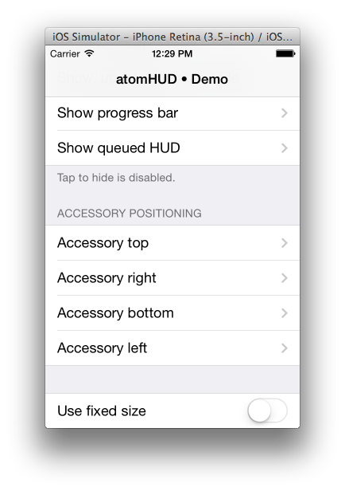

ATMHud - Library for the creation of HUDs in iPhone applications
================================================================
I once needed a HUD for one of my iPhone apps, but was unhappy with the currently available libraries on the internet. Therefore, I decided to create my own library. I've released it as a static library last year, but a lot of people wanted to see the source, so here it is.

-- Marcel <development@atomcraft.de> [original author]

# Operation

Create, configure, then show it. See the Demo app for more detail.

	// Keep a strong ivar reference to it (ie, "ATMHud *hud")
	hud = [[ATMHud alloc] initWithDelegate:self];  
	// or  hud = [ATMHud new]; using the block delegate

	[hud setCaption:@"Caption and an activity indicator."];
	[hud setActivity:YES];
	[hud showInView:self.view];
	...
	[hud hide];
	// when the delegate method tells you it's finished, you can nil the ivar out if you want
	hud = nil;
	// if you use the block delegate, you can release the hud there (see DemoViewController)

##**** Modifications, David Hoerl 2011-2014 ****

The reason I adopted this HUD is because it looks so nice, and it offered a wide range of customization options as well as the ability to get a slew of delegate messages as the HUD was presented and dismissed. Along with those you can get messages when the user taps within, or outside, the HUD.

I needed needed ARC, so I forked the project. My initial changes:    

 * ARCified
 * Modern syntax, default setters (no @synthesize)
 * more of the existing properties exposed along with some new ones
 * blockDelegate along with or for use without the traditional 'delegate'  callbacks
 * sound can be compiled out of the framework if you aren't using it (assuming most do not.)
 * converted to build error/warning free on iOS7 (required constant changes, many changes to UIKit extensions to NSString
 * 64 bit clean
 * handles view rotation (was a bug on original repository, unsure if I fixed it or not)

##Futures:

iOS7  circular determinate progress indicator (just ask for it!)

##History:

#3.0.0 - 2/20/2014

 * Added a Podspec to CocoaPods for this version
 * Font now uses UIFont ' preferredFontForTextStyle:UIFontTextStyleSubheadline''
 * Drop shadow removed (code still there, you can enable it if desired) for a more iOS7 look
 * Modified appearance defaults to   
    hud.appearScaleFactor = 0.8f;  
    hud.disappearScaleFactor = 0.8f;  
    hud.gray = 0.2f;  
    hud.alpha = 0.8f;  
 * Rolled in some of the original issues posted to atomcraft/ATMHud  
     14 - Gray property to set background color to a gray (not black), and added a setCenter method  
     15 - Screenshots in Readme.md  
     17 - Different orientation support? (assume this meant a landscape issue) 
     18 - use blocks api instead delegate
     21 - Pull Request - Small performance update  
     22 - Retain Cycle - changed property to "weak"  
     23 - removeViewWhenHidden property added (use ATMHud without a delegate)  
 * Experiment with various UI option by changing properties in DemoViewController (see pragma)
   
#2.x.x - 2011 - 2013
* various small tweaks, mostly to address Xcode Analyze errors
* 64 bit clean

#2.0.0 - 2011
* Forked code
* ARCified

#1.2 - Original

The demo project shows of most of the ways you can display the HUD (but not all the UI customization options):

NOTE: The original author's text follows the screen shots.

#ScreenShots

##***** Below is the original README text ******

Requirements
------------

  * iOS 4.0 or above  
  * QuartzCore.framework
  * AudioToolbox.framework (only if you want to use sounds)
  
Features
--------

  * Autorotation support
  * Fixed or dynamic size
  * Multiple accessories
  * Automation
  * Animations
  * Delegation
  * Block user interaction
  * Enable superview interaction
  * Retina display support
  * Selectable accessory position
  * Queueing of multiple HUDs
  * Custom positioning or auto-centering
  * Customizable appearance
  * Sound effects
  
Installation & Usage
--------------------
Just have a look at the sample project, everything is included there.

License
-------
ATMHud is licensed under BSD, have a look at the appropriate file for more information.

Contributions
-------------

  * Beta testers: @jonsterling @thermogl @GiloTM @phollow @Thyraz @saschalein @EdwinBrett @rbfigueira @abrrow @choise
  * @ChrisNTR for porting this to MonoTouch
  * @C418 for his [awesome music](http://c418.bandcamp.com/track/no-but-yes) as seen in the release video
  * and anyone else I forgot.
